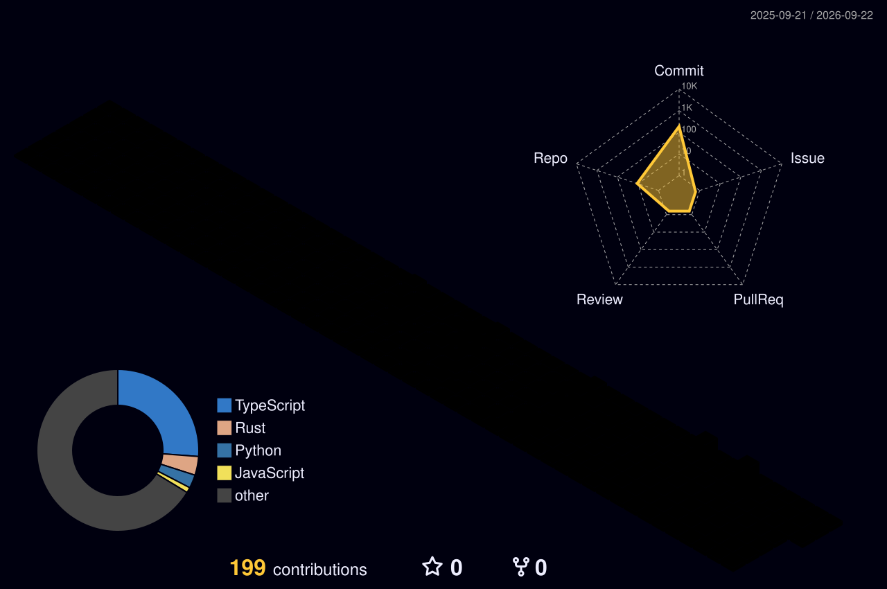

<!--
 ╔══════════════════════════════════════════════════════════════════════════╗
 ║  SILENTTEARS-CLOUD — GITHUB PROFILE README                              ║
 ║  Design System: Feminine Futurism v1.0                                  ║
 ║  Palette: Rose #ff2d78 · Violet #9b5de5 · Teal #0ff4c6 · Dark #0d1117  ║
 ║  Author: Ayushi Raj                                                     ║
 ╚══════════════════════════════════════════════════════════════════════════╝

  If you're reading this in raw markdown, you found the secret layer.
  Most people scroll past. The flowers bloom in the dark because they
  don't wait for permission. — A.R.

  ┌─────────────────────────────────────────────┐
  │  ▄▀█ █▄█ █░█ █▀ █░█ █                       │
  │  █▀█ ░█░ █▄█ ▄█ █▀█ █                       │
  │                                             │
  │  S I L E N T T E A R S - C L O U D         │
  └─────────────────────────────────────────────┘
-->

<!-- ╔══════════════════════════════════════════════╗
     ║  SECTION 1 — CINEMATIC HEADER               ║
     ╚══════════════════════════════════════════════╝ -->

<div align="center">


<br/>


<br/><br/>

<!-- Profile Views Counter -->

&nbsp;
<a href="https://github.com/Silenttears-cloud?tab=followers">
  
</a>

</div>

<br/>

<!-- ╔══════════════════════════════════════════════╗
     ║  SECTION 2 — ABOUT ME (SYSTEM MANIFEST)     ║
     ╚══════════════════════════════════════════════╝ -->


<details open>
<summary><b>&nbsp;🌸 &nbsp;Classified Dossier — <code>system/user/ayushi.ts</code></b></summary>

<br/>

<div align="center">

```typescript
// 🔴 🟡 🟢   system/user/ayushi.ts
// ────────────────────────────────────────────────────────

interface Developer {
  name: string;
  alias: string;
  roles: string[];
  education: string;
  currentFocus: string[];
  philosophy: string;
  aesthetic: string;
  status: string;
}

class Ayushi implements Developer {
  readonly name        = "Ayushi Raj";
  readonly alias       = "Silenttears-cloud";
  readonly location    = "India 🇮🇳";
  readonly education   = "BCA Student @ Amity University";

  readonly roles = [
    "Full-Stack Developer",
    "AI / ML Builder",
    "Prompt Engineer",
    "System Architect",
    "UI/UX Enthusiast",
    "Cloud & DevOps Explorer",
  ];

  readonly currentFocus = [
    "Building full-stack AI-powered applications",
    "Exploring cloud-native architecture patterns",
    "Crafting prompts that make LLMs do the impossible",
  ];

  readonly philosophy =
    "The best systems are built by those who notice what's missing. " +
    "Study deeply. Break things intentionally. Build what shouldn't exist.";

  readonly aesthetic  = "Dark mode. Always. // Stars only shine in the dark.";
  readonly status     = "🟢  Online — probably debugging something beautiful";

  code()   { return "// silence is where the best code is written"; }
  build()  { return this.currentFocus.map(f => `🔨 ${f}`); }
  vibe()   { return "Blooming in silence. Building in code."; }
}

export default new Ayushi();
```

</div>
</details>

<br/>

<!-- ╔══════════════════════════════════════════════╗
     ║  SECTION 3 — CURRENTLY BUILDING             ║
     ╚══════════════════════════════════════════════╝ -->


<div align="center">

### 🟢 &nbsp; Currently Hacking On

</div>

```
🔭  Building full-stack AI applications that solve real problems
🧠  Architecting systems at the intersection of AI, Cloud & UX
🌱  Deep-diving into LLMs, RAG pipelines & agentic workflows
⚡  Crafting UI/UX that makes people stop and stare
🔐  Learning cloud-native patterns on AWS / GCP
```

> *"The most dangerous builder is one who understands design AND systems."*

<br/>

<!-- ╔══════════════════════════════════════════════╗
     ║  SECTION 4 — TECH STACK CONSTELLATION       ║
     ╚══════════════════════════════════════════════╝ -->


<div align="center">

### ✦ &nbsp; Tech Stack &nbsp; ✦

**Languages & Markup**


**Frameworks & Libraries**


**AI & Cloud**


**Tools & Workflow**


</div>

<br/>

<!-- ╔══════════════════════════════════════════════╗
     ║  SECTION 5 — STATS TRILOGY                  ║
     ╚══════════════════════════════════════════════╝ -->


<div align="center">

### 📊 &nbsp; GitHub Intelligence

<br/>

<a href="https://github.com/Silenttears-cloud">
  
</a>
<a href="https://github.com/Silenttears-cloud">
  
</a>

<br/>

<a href="https://git.io/streak-stats">
  
</a>

</div>

<br/>

<!-- ╔══════════════════════════════════════════════╗
     ║  SECTION 6 — GITHUB TROPHIES                ║
     ╚══════════════════════════════════════════════╝ -->


<div align="center">

### 🏆 &nbsp; Achievement Vault

<br/>

<a href="https://github.com/ryo-ma/github-profile-trophy">
  
</a>

</div>

<br/>

<!-- ╔══════════════════════════════════════════════╗
     ║  SECTION 7 — 3D CONTRIBUTION GRAPH          ║
     ╚══════════════════════════════════════════════╝ -->


<div align="center">

### 🌌 &nbsp; Contribution Constellation

<br/>

<picture>
  <source media="(prefers-color-scheme: dark)" srcset="./profile-3d-contrib/profile-night-rainbow.svg" />
  <source media="(prefers-color-scheme: light)" srcset="./profile-3d-contrib/profile-gitblock.svg" />
  
</picture>

<br/>

*Every commit is a star added to the constellation.*

</div>

<br/>

<!-- ╔══════════════════════════════════════════════╗
     ║  SECTION 8 — CONTRIBUTION SNAKE             ║
     ╚══════════════════════════════════════════════╝ -->


<div align="center">

### 🐍 &nbsp; Snake Protocol — Consuming the Grid

<br/>

<picture>
  <source media="(prefers-color-scheme: dark)" srcset="https://raw.githubusercontent.com/Silenttears-cloud/Silenttears-cloud/output/github-contribution-grid-snake-dark.svg" />
  <source media="(prefers-color-scheme: light)" srcset="https://raw.githubusercontent.com/Silenttears-cloud/Silenttears-cloud/output/github-contribution-grid-snake.svg" />
  
</picture>

</div>

<br/>

<!-- ╔══════════════════════════════════════════════╗
     ║  SECTION 9 — WAKATIME STATS                 ║
     ╚══════════════════════════════════════════════╝ -->


<div align="center">

### ⏱️ &nbsp; Live Coding Telemetry

<br/>

<a href="https://wakatime.com/@Silenttears-cloud">
  
</a>

</div>

<br/>

**📈 Weekly Coding Log:**

<!--START_SECTION:waka-->
<!--END_SECTION:waka-->

<br/>

<!-- ╔══════════════════════════════════════════════╗
     ║  SECTION 10 — RECENT ACTIVITY FEED          ║
     ╚══════════════════════════════════════════════╝ -->


<div align="center">

### ⚡ &nbsp; Recent Activity Feed

</div>

<!--START_SECTION:activity-->
1. 🎉 Initialized the **Silenttears-cloud** profile — the constellation begins
<!--END_SECTION:activity-->

<br/>

<!-- ╔══════════════════════════════════════════════╗
     ║  SECTION 11 — DEV PHILOSOPHY                ║
     ╚══════════════════════════════════════════════╝ -->


<div align="center">

### 🌸 &nbsp; System Manifest

</div>

```rust
// ─────────────────────────────────────────────────────────────────
//  SYSTEM MANIFEST  //  Ayushi Raj  //  Silenttears-cloud
// ─────────────────────────────────────────────────────────────────

struct Manifest {
    belief:    &'static str,
    method:    &'static str,
    aesthetic: &'static str,
    rule:      &'static str,
    motto:     &'static str,
}

const AYUSHI: Manifest = Manifest {
    belief:    "The best systems are built by those who notice what's missing.",
    method:    "Study deeply. Break things intentionally. Build what shouldn't exist.",
    aesthetic: "Dark mode always — stars only shine in the dark.",
    rule:      "Never ship ugly code. Never ship ugly UI. Never settle.",
    motto:     "Blooming in silence. Building in code.",
};

fn main() {
    println!("Status: {}", "🟢  Online — Probably building something dangerous.");
    println!("Philosophy: {}", AYUSHI.motto);
}
```

<br/>

<!-- ╔══════════════════════════════════════════════╗
     ║  SECTION 12 — CONNECT & FOOTER              ║
     ╚══════════════════════════════════════════════╝ -->


<div align="center">

### 🔗 &nbsp; Open a Secure Channel

<br/>

<a href="https://github.com/Silenttears-cloud">
  
</a>
&nbsp;
<a href="mailto:your-email@example.com">
  
</a>
&nbsp;
<a href="https://linkedin.com/in/YOUR-LINKEDIN">
  
</a>
&nbsp;
<a href="https://YOUR-PORTFOLIO.dev">
  
</a>

<br/><br/>


</div>

<!-- ═══════════════════════════════════════════════════════════════
     You made it to the very end. Respect.
     Now go build something that makes people say "wait, how?"
     — Ayushi Raj / Silenttears-cloud
     ══════════════════════════════════════════════════════════════ -->
